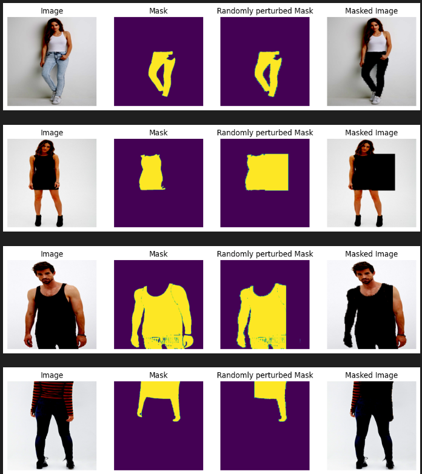

# FashionXchange
Have you ever had a photo of your's where you had not dressed for the occation or had overdressed or you simply wish you wore a different outfit?

Worry not! 

With our application (in development) you can modify  your clothes with just text instructions. Below is a short demo of our tool!

<!--  -->

Our pipeline for modifying outfits uses GroundingDINO, Segment Anything Model and Stable Diffusion.

## Updated from stabilityai/stable-diffusion-2-inpainting model
- We finetuned the stable diffusion model with the DeepFashion dataset and Flickr30k for prior preservation 
- We utilized targetted masking in place of random masking for finetuning inpainting model (This helped in maintaining the skin tone)
- The goal was to improve pose retention of the person, skin tone reconstruction, reduce distortion and generate more accurate results for complex modification requests

Below are some example use cases where we observed some improvements over the baseline model (stabilityai/stable-diffusion-2-inpainting model)

<table>
  <tr>
    <th>Prompt</th>
    <th>Source Image</th>
    <th>Baseline Model</th>
    <th>Our Model</th>
  </tr>
  <tr>
    <td align="center">A man in red hoodie with black sleeves</td>
    <td align="center"></td>
    <td align="center"></td>
    <td align="center"></td>
  </tr>
  <tr>
    <td align="center">A woman in pajama</td>
    <td align="center"></td>
    <td align="center"></td>
    <td align="center"></td>
  </tr>
  <tr>
    <td align="center">A man in white shirt, black jacket and leather pants</td>
    <td align="center"></td>
    <td align="center"></td>
    <td align="center"></td>
  </tr>
</table>

## Installation Instructions
1. Create a conda environment

    `conda env create -f environment.yml`

2. Install GroundingDINO:

    - `git clone https://github.com/IDEA-Research/GroundingDINO.git`

    - `pip install -e ./GroundingDINO`

3. Download model files:

    - GroundingDINO and SAM:

        `python download_files.py`
     
    The weights of our finetuned model is available on Huggingface and will be automatically downloaded.

## Hardware requirements:
    - We suggest the use of a GPU with minimum 24GB VRAM (occupies ~18GB) for running and using the streamlit application (~20 seconds per image).
    - The streamlit application can be run on CPU (on a standard i7 processor, it takes ~5 minutes per image) 

## Usage
    1. Streamlit Application (See demo above)
    a. Launch the streamlit application using the following command:
       `streamlit run streamlit/main.py`
    b. Upload the image in which you want to make the modification
    c. If there are multiple people in the image, the application shows the people individually and allows the user to select for which person they want to make the outfit modification
    d. Once the person is selected, the user can define what the modification needed is and the target area to mask
    e. The application makes the modification and returns the original image with the modification requested.

## TODO (Work on Current Limitations)
1. Clothing length modification is not consistent (Finetuning in progress)
2. Although distortion is reduced compared to baseline, it still exists
3. Reproducibility of results

## References

[1]: Yuming Jiang, Shuai Yang, Haonan Qiu, Wayne Wu, Chen Change Loy, Ziwei Liu. "Text2Human: Text-Driven Controllable Human Image Generation." *ACM Transactions on Graphics (TOG)*, volume 41, number 4, articleno 162, pages 1-11, 2022. [DOI: 10.1145/3528223.3530104](https://doi.org/10.1145/3528223.3530104)

[2]: Ziwei Liu, Ping Luo, Shi Qiu, Xiaogang Wang, Xiaoou Tang. "DeepFashion: Powering Robust Clothes Recognition and Retrieval with Rich Annotations." *Proceedings of IEEE Conference on Computer Vision and Pattern Recognition (CVPR)*, June 2016.

[3]: Robin Rombach, Andreas Blattmann, Dominik Lorenz, Patrick Esser, Björn Ommer. "High-Resolution Image Synthesis With Latent Diffusion Models." *Proceedings of the IEEE/CVF Conference on Computer Vision and Pattern Recognition (CVPR)*, June 2022, pages 10684-10695.

[4]: Shilong Liu, Zhaoyang Zeng, Tianhe Ren, Feng Li, Hao Zhang, Jie Yang, Chunyuan Li, Jianwei Yang, Hang Su, Jun Zhu, and others. "Grounding DINO: Marrying DINO with Grounded Pre-training for Open-Set Object Detection." *arXiv preprint arXiv:2303.05499*, 2023.

[5]: Alexander Kirillov, Eric Mintun, Nikhila Ravi, Hanzi Mao, Chloe Rolland, Laura Gustafson, Tete Xiao, Spencer Whitehead, Alexander C. Berg, Wan-Yen Lo, Piotr Dollár, Ross Girshick. "Segment Anything." *arXiv:2304.02643*, 2023.

